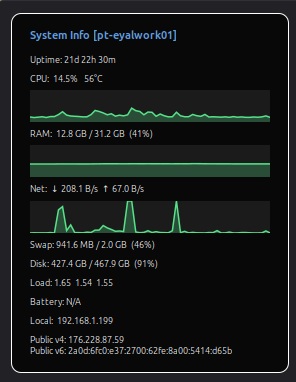

# System Info — Cinnamon Desklet

A configurable desktop widget for the Cinnamon desktop (Linux Mint, or Cinnamon on Ubuntu) that displays live system metrics with optional history sparklines. The title includes your hostname — handy when the same desklet runs on more than one machine.

## Metrics

- **CPU** — usage % and package temperature
- **RAM** — used / total
- **Swap** — used / total
- **Disk** — used / total for `/`
- **Uptime** — days / hours / minutes since boot
- **Load average** — 1 / 5 / 15 minute
- **Battery** — capacity % and charging state (auto-hidden on desktops)
- **Network** — aggregate ↓/↑ throughput, optionally broken down per interface
- **IP addresses** — local IP and public IP are now separate sections (each can be enabled or hidden independently). Local IP tries `hostname -I` then falls back to `ip -4 addr`. Public IP goes through `curl ifconfig.me` and is cached for 5 minutes.

The desklet reads directly from `/proc` and `/sys` — no external daemons. Only `hostname`, `df`, and (optionally) `curl` are shelled out to; all are part of a standard Ubuntu install.

## Configurable (right-click → **Configure**)

- Refresh interval (1–60 s)
- Font size, theme (auto / dark / light), and **background opacity** (0–100 %, use 0 for a fully transparent panel)
- **Reorderable sections** — the *Sections* tab uses a list widget with Move Up / Move Down / Add / Remove / Show buttons, so you choose which stats appear and in which order
- Public-IP lookup on the IP row (opt-in)
- Sparkline graphs: on/off, width, height, history length (samples), and line color

## Install / upgrade

```bash
git clone https://github.com/pessacheyal/cinnamon-sysinfo-desklet.git
cd cinnamon-sysinfo-desklet
./install.sh
```

`install.sh` copies the desklet into `~/.local/share/cinnamon/desklets/` and asks Cinnamon to reload. It works the same for a fresh install and an upgrade — your saved settings under `~/.config/cinnamon/spices/sysinfo@pessacheyal/` are left alone. To upgrade later:

```bash
git pull
./install.sh
```

Pass `--no-reload` to skip the Cinnamon-restart step (e.g., when running over SSH). After a fresh install, right-click the desktop → **Add desklets to desktop** → **System Info** → **+ Add to desktop**.

<details>
<summary>Manual install (if you prefer no script)</summary>

```bash
mkdir -p ~/.local/share/cinnamon/desklets
cp -r sysinfo@pessacheyal ~/.local/share/cinnamon/desklets/
# Alt+F2 → r → Enter to reload Cinnamon
```

</details>

## Tested on

- Cinnamon 5.x / 6.x
- Ubuntu 22.04 / 24.04 with the `cinnamon-desktop-environment` package
- Linux Mint 21 / 22

## Layout

```
sysinfo@pessacheyal/
├── metadata.json          # uuid, version, description
├── settings-schema.json   # user-facing settings surface
├── desklet.js             # main logic (metrics, drawing, settings binding)
└── stylesheet.css         # static fallback styles (colors are inlined)
```

## Screenshot



## License

MIT
